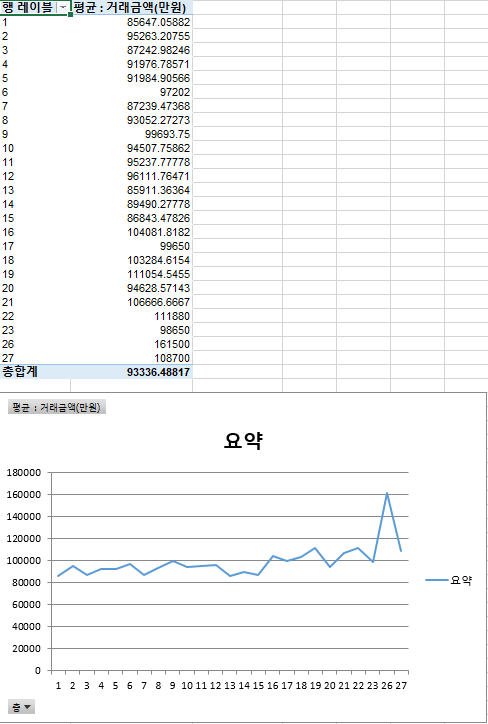

# 서대문구 아파트 층별 실거래가 데이터 분석/시각화

## 사용한 지침들
+ 현재 어떤 엑살파일이 열려있지?
  - ✦ 현재 '아파트(매매)_거래정보2025_9_29_13_17_3.xls' 파일이 열려있습니다.

+ 엑셀 시트 데이터를 기반으로 데이터를 분석해서 시각화 해보려고해. 어떤 데이터를 비교분석하는 것이 좋을까?
  - ✦ 좋은 소식입니다! 데이터 구조를 파악했습니다. 파일에 '표3'이라는 이름으로 데이터가 잘 정리되어 있었네요. 자동
   변환 도구가 오작동한 것 같습니다.
  이제 데이터 내용을 확인했으니, 다음과 같은 분석과 시각화를 제안해 드립니다. 어떤 것을 진행해 볼까요?
  데이터: 서대문구 아파트 실거래가 정보 (991건)
  ---
  분석 제안:
   1. 📈 시간 흐름에 따른 가격 변화 (선 차트)
   2. 🏘️ 동별 평균 가격 비교 (막대 차트)
   3. 💰 면적과 가격의 관계 (분산형 차트)
  어떤 분석을 먼저 시각화해 드릴까요? 번호를 말씀해 주세요.

## 데이터 인사이트
+ 현재 데이터에서 '층'에 따른 가격 데이터를 비교분석하고 싶어. 현재 데이터에서 면적의 정수가 59로 표기된 데이터만 따로 추출해서 진행해줘 
  - ✦ 네, 알겠습니다. '서대문구 아파트 실거래가' 데이터를 사용하여 '층'에 따른 가격을 비교 분석하고,
  '건물전용면적(㎡)'의 정수 부분이 59인 데이터만 추출하여 진행하겠습니다.
  먼저 데이터의 구조를 파악하기 위해 엑셀 파일의 시트와 테이블 목록을 확인하겠습니다.
  - ✦ pivot-configure 명령어의 도움말을 확인했습니다. 이 명령어를 사용하면 '건물전용면적(㎡)'을 피벗 테이블의
  '필터' 영역으로 추가할 수는 있지만, "정수 부분이 59"와 같이 복잡한 조건을 직접 지정하여 필터링하는 기능은
  제공하지 않습니다.

  따라서 요청하신 조건으로 데이터를 자동으로 필터링하여 분석하는 것은 현재 제공된 도구로는 어렵습니다.
+ (데이터 필터링 수작업 진행)
  - ✦ 피벗 테이블이 '분석' 시트에 성공적으로 생성되었습니다.
  이제 이 피벗 테이블에 필드를 설정하여 '층'을 행으로, '거래금액(만원)'의 평균을 값으로 지정하겠습니다.
  - ✦ 피벗 테이블 구성이 완료되었습니다. '층'별 평균 '거래금액(만원)'이 계산되었습니다.

  이제 마지막 단계로, 이 피벗 테이블 데이터를 기반으로 '층별 평균 거래금액'을 보여주는 선 차트를
  생성하겠습니다.
  - ✦ 분석이 완료되었습니다.

  엑셀 파일에 '분석'이라는 새 시트가 추가되었습니다. 해당 시트에는 '층'별 평균 '거래금액(만원)'을 계산한
  피벗 테이블과 이를 시각화한 선 차트가 생성되어 있습니다.

  파일은 저장되었으니 지금 바로 확인하실 수 있습니다.
  
## 생성된 엑셀 시각화 (차트)

