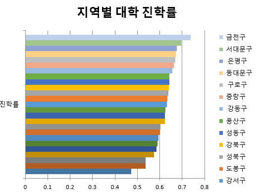
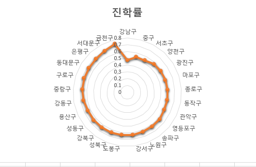

# 서울시 지역별 대학 진학율 데이터 분석/시각화

## 사용하신 지침들
+ 어떤 엑셀파일이 열려 있어?
+ 파일은 서울지역 입학자 중 졸업자 및 졸업후 진학자 수치야 E열에 졸업자 전체 중 졸업후 진학자 전체 비율을 작성해
+ 이제 이 데이터를 가지고 데이터를 분석해서 시각화해보자, 단계적으로 확인받으며 진행하
+ 서울시 25개 지역이 표시된 그림에 위의 수치를 입히는 시각화를 하고 싶어 추천해줄만한 작업이 있을
    - Python을 사용하여 이 시각화를 생성할 수 있습니다. 이 방법을 사용하면, 서울시 25개 구의 경계가표시된 지도 위에 각 구의 진학률을 색상으로 표현하는 멋진 시각화 자료를 만들 수 있습니다. Python을 사용하여 단계 구분도를 생성하는 작업을 진행해 드릴까요? 이 작업은 다음과 같은 단계로 진행됩니다.
    - 진행해
    - 제공해주신 '서울시 지도' 웹 서비스(https://map.seoul.go.kr/smgis2/seoulMap)는 제가 직접 데이터를 연동하거나 조작할 수 있는 형태가 아닙니다.제가 생성해 드린 seoul_advancement_rate_map.html 파일은 웹 브라우저에서 열 수 있는 인터랙티브 지도 파일입니다. 이 파일을 통해 서울시 각 구의 진학률을 지도 위에서 직접 확인하실 수 있습니다. 만약 특정 웹 서비스에 데이터를 연동하고 싶으시다면, 해당 서비스의 API를 사용하거나 수동으로 데이터를
  입력해야 하는데, 이는 현재 저의 기능 범위를 벗어납니다.
    - 시각화 포기..

## 데이터 인사이트
 - **진학률 격차**  
  - 최저 구(강남구: 약 47%)와 최고 구(금천구: 약 74%) 사이에 **27%p 이상 차이** 존재  
- **공간적 분포 특징**  
  - 강남·서초·양천 등 일부 교육 인프라가 발달한 지역의 진학률은 상대적으로 낮음  
  - 금천·서대문·은평 등은 상대적으로 높은 진학률을 기록  
- **시사점**  
  - 단순한 지역별 교육 수준이 아닌, **진학률을 결정하는 사회·경제적 요인**에 대한 추가 분석 필요  
  - 교육 정책 수립 시 **지역별 맞춤형 접근** 필요  

## 생성된 엑셀 시각화 (차트)
2. **Matplotlib Bar Chart**  
   - 진학률 내림차순 정렬 → 상위/하위 구별 차이 비교 용이  

차트만 스크린캡처를 해서 이미지로 저장.

