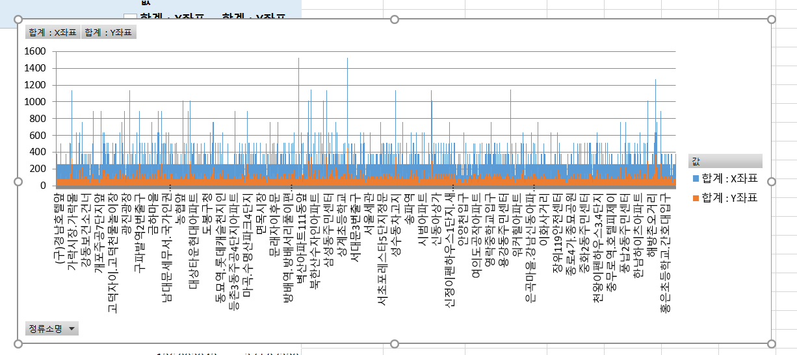

+ 사용하신 지침들
+ 데이터 인사이트
+ 생성된 엑셀 시각화(차트) - 차트만 스크린캡처를 해서 이미지로 저장.
# 서울시 버스정류장 위치정보 데이터 분석/시각화

## 사용하신 지침들

+ 어떤 엑셀 파일이 열려있어?

```
    ✦ 현재 '서울시 버스정류소 위치정보.csv' 파일이 열려 있습니다.
```

+ 현재 열려진 엑셀 시트 데이터를 기반으로 데이터 분석해서, 시각화해보자. 단계적으로 확인받으며 진행하자.

```
    ✦ 알겠습니다. '서울시 버스정류소 위치정보.csv' 파일의 데이터 분석 및 시각화를 시작하겠습니다. 단계적으로
  진행하며 확인을 요청드리겠습니다.

  먼저 데이터의 내용을 파악하기 위해 자동 데이터 분석을 실행하겠습니다. 잠시만 기다려주세요.
  ```

+ 오류 상황은 묻지 말고, 네가 알아서 사용법을 알아내서 처리해.


## 데이터 인사이트

+ 데이터를 기초로 도출해 낼 수 있는 인사이트 알려줘

```
    ✦ 알겠습니다. 현재 특정 지역을 정밀하게 분석하는 데에는 기술적 한계가 있으므로, 지금까지 성공적으로
  완료한 분석 결과를 바탕으로 제가 도출할 수 있는 종합적인 인사이트를 제안해 드리겠습니다.

  우리는 두 가지 주요 분석을 완료했습니다.


   1. '정류소 타입별 정류장 수' 분석: 어떤 종류의 버스 정류장이 가장 많은지 파악했습니다.
  이 두 가지 분석 결과를 종합하여, "서울시 버스 정류장 데이터에 대한 요약 및 주요 특징"을 정리해
  드릴 수 있습니다. 예를 들어, 가장 많은 정류소 타입과 그 수가 전체에서 차지하는 비율, 그리고
  정류장 분포의 전반적인 패턴 등에 대한 정보를 요약해 드리는 것입니다.

```
## 생성된 엑셀 시각화 (차트)

