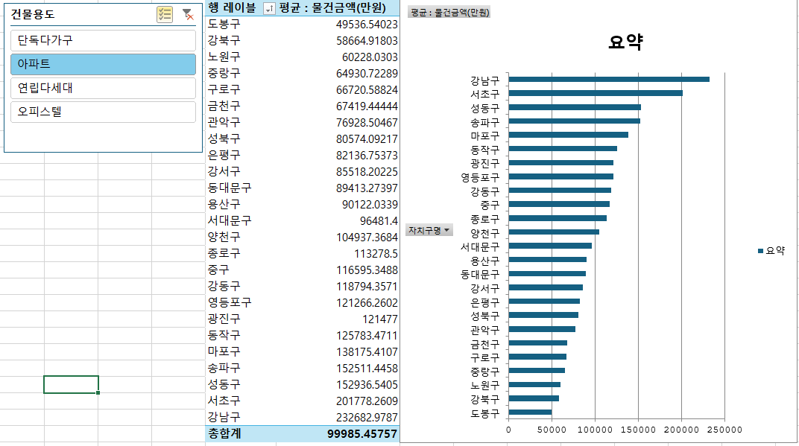
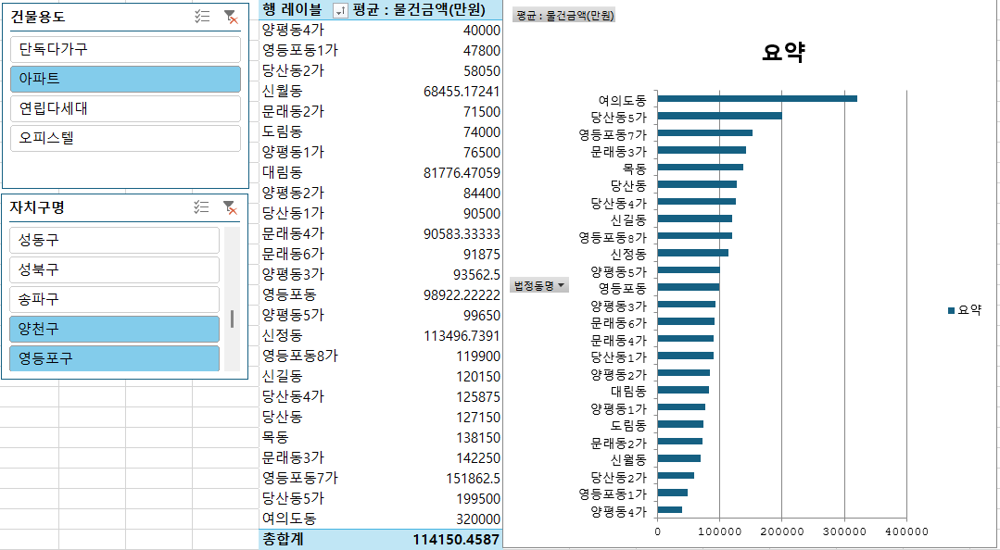

# 2025 서울시 부동산 실거래가 분석

## 사용하신 지침들

+ 어떤 엑셀 파일이 열려있어?

```
✦ 현재 '2025서울시부동산실거래가.xlsx' 파일이 열려있습니다.
```

+ 현재 열려진 엑셀 시트 데이터를 기반으로 데이터 분석해서, 시각화해보자. 단계적으로 확인받으며 진행하자.

```
✦ 좋습니다. 데이터의 열 정보를 성공적으로 읽어왔습니다.


  분석 가능한 주요 데이터 항목:
  자치구명, 법정동명, 계약일, 물건금액(만원), 건물면적(㎡), 건축년도, 건물용도

  ---

  이제 이 데이터를 바탕으로 의미 있는 분석을 진행해 보겠습니다.

  2단계: 데이터 분석 및 시각화 제안


  "자치구별 평균 물건금액(만원)"을 분석하는 것은 어떠신가요? 이 분석을 통해 어느 지역의 부동산 가격이 높은지
   한눈에 파악할 수 있습니다.


  이 분석을 위해 피벗 테이블과 차트를 자동으로 생성하려고 합니다. 진행할까요? (Y/N)

```

+ '건물용도'가 '아파트'인 경우만 통계를 내고 싶어. 자치구별 아파트의 물건금액의 통계를 내줘.

```
✦ 알겠습니다. '건물용도'가 '아파트'인 경우로 한정하여 '자치구별 아파트 평균 금액' 통계를 다시 내겠습니다.

  이를 위해 기존에 만들었던 피벗 테이블에 '건물용도'를 필터링할 수
  있는 슬라이서(Slicer)를 추가하겠습니다. 슬라이서를 이용하면
  사용자가 직접 원하는 항목을 선택하여 데이터를 필터링할 수 있습니다.
```

양천구, 영등포구의 동별 아파트 가격을 비교해보자

```
✦ 모든 분석 준비가 완료되었습니다. '양천구분석'이라는 새로운 시트에 원하시는 분석 결과를 모두 생성했습니다.

  '양천구분석' 시트에서 다음을 진행해주세요:


   1. [자치구명] 슬라이서(필터)에서 '양천구'를 선택합니다.
  이제 '양천구 동별 아파트 평균 가격'을 보여주는 막대 차트가 나타날 것입니다. 이 차트를 통해 양천구 내 어느
  동의 아파트 가격이 높은지 한눈에 비교하실 수 있습니다.
  ```


## 데이터 인사이트

+ 서울시 자치구별 아파트의 물건금액 비교 분석  
+ 양천구와 영등포의 동별 아파트 가격을 비교 분석

## 생성된 엑셀 시각화 (차트)
+ 자치구별 아파트 물건금액 비교 분석 결과



+ 양천구 및 영등포구의 동별 아파트 물건금액 비교 분석 결과



 
 