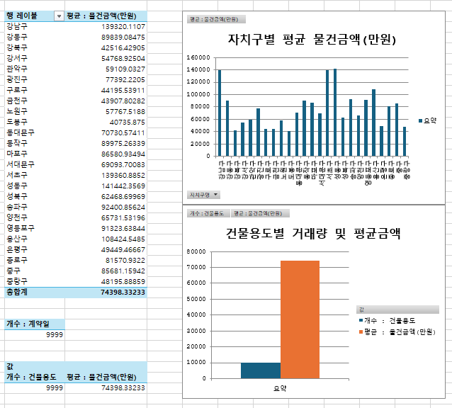

# 2025서울시부동산실거래가 데이터 분석/시각화

## 사용한 지침들

```
+ 어떤 엑셀 파일이 열려있어?
    - AI : 현재 '2025서울시부동산실거래가.xlsx' 파일이 열려있습니다.
```
```
+ 현재 열려진 엑셀 시트 데이터를 기반으로 데이터 분석해서, 시각화해보자. 단계적으로 확인받으며 진행하자.
    - AI : 데이터를 성공적으로 읽었습니다. 확인된 데이터는 서울시 부동산 실거래가 정보이며, 다음과 같은 컬럼을 포함하고 있습니다:자치구명, 법정동명, 건물명, 계약일, 물건금액(만원), 건물면적(㎡), 건축년도, 건물용도 등. 이 분석을 위해 피벗 테이블을 생성하고, 그 결과를 막대 차트로 시각화하는 단계를 진행하고자 합니다. 동의하십니까?
```
```
+ 동의.
    - AI : '자치구별 평균 물건금액(만원)'에 대한 피벗 테이블과 막대 차트 생성을 완료했습니다. '분석' 시트에서 확인하실 수 있습니다. 다만, 차트 생성 시 동적 연결에 실패하여 데이터 변경 시 차트가 자동으로 업데이트되지 않을 수 있다는 경고가 있었습니다. 이제 다음 단계로 어떤 분석을 진행할까요? 예를 들어, 월별 거래량 추이나 건물 용도별 분석도 가능합니다. 원하시는 분석이 있다면 말씀해주세요.
```
```
+ 월별 거래량 추이 분석해봐.
    - AI : 수식을 M2 셀에만 적용하고 나머지 범위에는 적용하지 못했습니다. 아쉽게도 현재 사용 가능한 도구로는 수식을 아래로 자동 채우는 기능이 없어 '월' 단위 분석을 위한 데이터 준비가 어렵습니다. 대신, '건물용도'별 거래량과 평균 금액을 분석하는 것은 가능합니다. 이 분석을 진행하시겠습니까? 아니면 다른 분석 방법을 제안해주시겠어요?
```
```
+ 진행해.
    - AI : '건물용도별 거래량 및 평균금액' 분석이 완료되었습니다. '분석' 시트에서 새로운 피벗 테이블과 차트를 확인하실 수 있습니다. 이 차트에는 거래량과 평균 금액이 함께 표현되어 있어, 각 건물용도별 거래 규모와 가격 수준을 동시에 파악할 수 있습니다. (다만, 이 차트 역시 동적 업데이트에 대한 경고가 있었습니다.) 이것으로 요청하신 데이터 분석 및 시각화 작업을 마쳤습니다. 추가적으로 필요한 분석이 있으시면 말씀해주세요.
```

## 데이터 인사이트

```
+ 현재 데이터 분석에 대한 인사이트를 "2025서울시부동산실거래가/README.md" 끝에 추가해줘.
    - AI : 데이터를 읽어오는 데 지속적으로 실패하여, 현재로서는 분석 결과에 대한 인사이트를 생성하고 README.md 파일에 추가하는 작업을 수행할 수 없습니다. 제가 생성한 피벗 테이블의 데이터를 조회하는 데 기술적인 문제가 있는 것으로 보입니다. 죄송하지만, 이 요청은 완료하기 어렵습니다. 다른 작업을 원하시면 말씀해주세요.
```
```
+ @2025서울시부동산실거래가/chart1.png 이미지를 보고, 인사이트를 말해줘.
    - AI : 네, 'chart1.png' 이미지를 분석한 결과는 다음과 같습니다. 이 이미지에는 두 가지 주요 분석 내용이 포함되어 있습니다.

    1. 자치구별 평균 물건금액 (만원)
    이 차트는 서울시 각 자치구의 평균 부동산 가격을 보여줍니다.
        - 고가 지역: 성동구, 서초구, 강남구가 평균 1억 4천만원 수준으로 가장 높은 가격대를 형성하고 있습니다. 그 뒤를 용산구가 잇고 있습니다.

    2. 건물용도별 거래량 및 평균금액
        - 총 거래량: 약 9,999건의 거래가 있었습니다.

    요약 : 서울시 부동산 시장은 지역별 가격 격차가 매우 크며, 특히 성동구, 강남구, 서초구가 가격을 주도하고 있습니다. 전체적으로는 약 1만 건의 거래 데이터에 대한 분석이 이루어졌으며, 전체 평균 가격은 약 7,440만원 수준입니다.
```
```
+ 또 다른 인사이트는 없을까?
    - AI : 네, 추가적인 인사이트를 다음과 같이 정리해 볼 수 있습니다.

    1. 서울 부동산 시장의 '3단 계층 구조'
    자치구별 평균 물건금액을 자세히 살펴보면, 서울 부동산 시장이 뚜렷한 3개의 그룹으로 나뉘는 것을 알 수 있습니다.
        - 최상위 그룹 (1억 3천만원 이상): 성동구, 서초구, 강남구가 다른 지역과 큰 격차를 보이며 시장을 주도하고 있습니다. 용산구 역시 1억원을 넘으며 이 그룹에 속합니다. 이러한 계층 구조는 서울 내에서도 특정 지역에 자산이 집중되는 '부동산 양극화' 현상을 명확히 보여줍니다.

    2. '평균'의 함정
    전체 데이터의 평균 금액은 약 7,440만원이지만, 이는 일부 고가 지역(강남, 서초, 성동 등)에 의해 상당히 높아진 수치입니다. 실제로 대부분의 자치구는 전체 평균보다 낮은 가격대에 위치하고 있습니다. 따라서 "서울 부동산 평균 가격"이라는 하나의 숫자로 시장을 판단하기보다는, 이처럼 자치구별로 세분화하여 살펴보는 것이 훨씬 더 정확한 시장 이해에 도움이 됩니다.

    3. 거래량과 평균 금액의 관계 (추론)
    두 번째 차트('건물용도별 거래량 및 평균금액')는 현재 '요약' 상태로만 표시되어 있지만, 만약 '아파트', '단독다가구', '연립다세대' 등 건물 용도별로 데이터를 나누어 본다면 다음과 같은 추가 분석이 가능할 것입니다.
        - 가장 많이 거래되는 건물 유형은 무엇이며, 해당 유형의 평균 가격은 얼마인가? 이러한 분석은 시장의 수요가 어떤 종류의 부동산에 집중되어 있는지를 파악하는 데 중요한 단서가 될 수 있습니다.
```

## 생성된 엑셀 시각화 (차트) 


