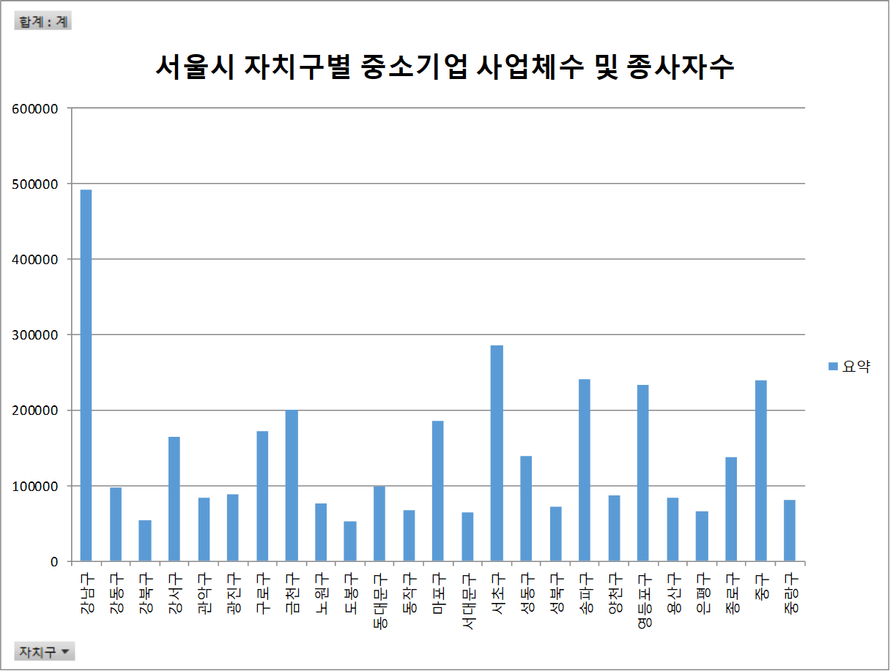

# 서울시 자치구별 중소기업 사업체수 및 종사자수

## 사용하신 지침들
    - 현재 어떤 엑셀 파일이 열려있어?
    - 다음으로 어떤 작업 해야해?
    - 현재 열려진 엑셀 시트 데이터를 기반으로 데이터분석해서 시각화하고 싶어.

## 데이터 인사이트
✦ 자치구별 분석을 통해 다음과 같은 인사이트를 도출할 수 있습니다.

  1. 총합계 및 전반적인 분포:
  *   서울시 전체의 '계' 총합은 3,566,087입니다. 이 '계'는 원본 데이터의 '구분' 필드에 따라 '사업체수' 또는 '종사자수'를 나타낼 수 있으며, 현재는 두 지표가 합산된 값으로 보입니다.
  *   자치구별 '계' 값은 상당한 편차를 보이며, 특정 지역에 경제 활동이 집중되어 있음을 시사합니다.

  2. 상위 경제 활동 자치구:
     강남구 (491,232)*: 압도적으로 가장 높은 '계' 값을 기록하여 서울에서 경제 활동이 가장 활발한 지역임을 명확히 보여줍니다.
     서초구 (286,015), 송파구 (241,078), 중구 (240,005), 영등포구 (233,436), 금천구 (201,047)*: 이들 자치구 또한 높은 '계' 값을 보이며, 서울의 주요 상업, 업무, 산업 중심지로서의 역할을
  반영합니다.

  3. 상대적으로 낮은 경제 활동 자치구:
     도봉구 (52,235), 강북구 (54,503)*: 다른 자치구에 비해 '계' 값이 현저히 낮습니다. 이는 이들 지역의 경제 활동 규모가 상대적으로 작거나, 주거 지역의 비중이 높을 수 있음을 나타냅니다.

  4. 지역별 불균형:
  *   '계' 값의 분포는 서울 내 자치구 간 경제 활동 규모의 상당한 불균형을 보여줍니다. 이는 지역별 특화 전략이나 균형 발전을 위한 정책 수립 시 고려해야 할 중요한 요소입니다.

## 생성된 엑셀 시각화 (차트)
