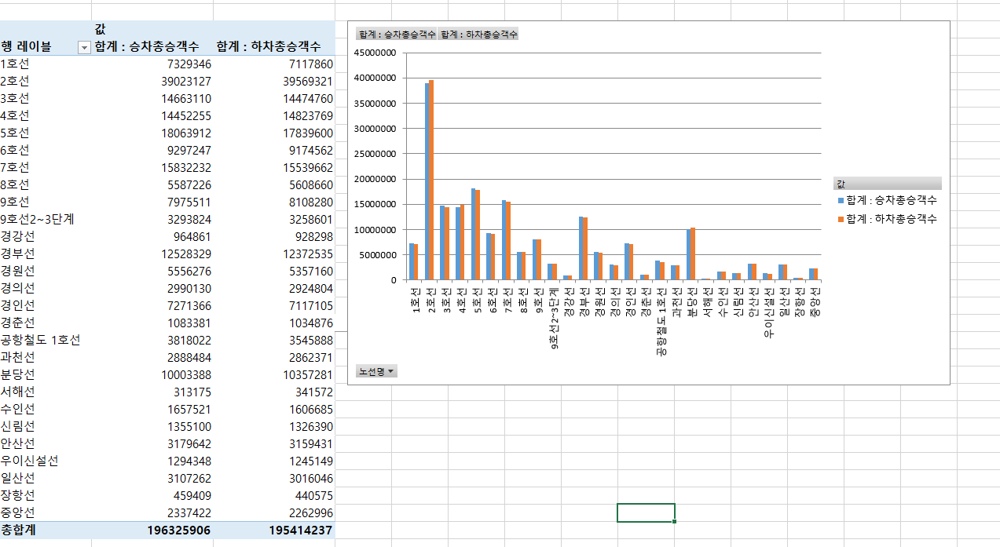
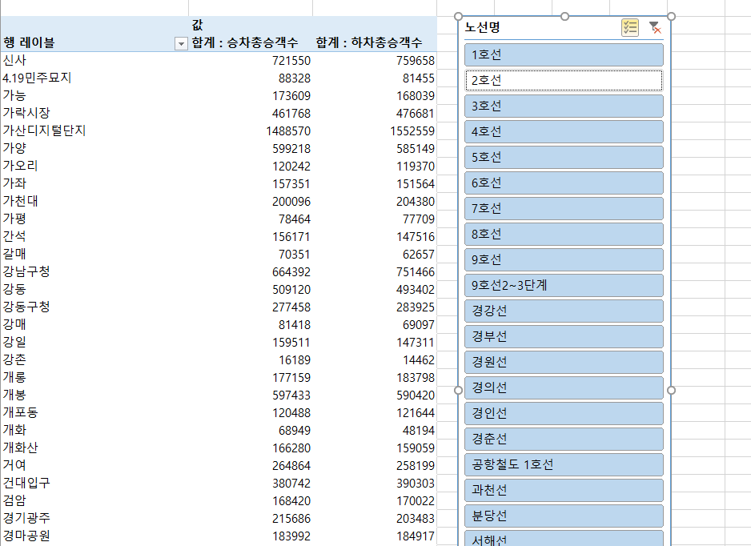

# 서울시 지하철 승하차 인원 데이터 분석/시각화

## 사용한 지침들

+ 현재 열려있는 엑셀파일 확인해줘. 
    - GEMINI : 현재 '지하철승하차인원.xlsx' 파일이 열려 있습니다.
+ 현재 열려진 엑셀 시트 데이터를 기반으로 데이터를 분석하고, 시각화해보자. 단계적으로 확인받으며 진행하자.
    - 알겠습니다. 현재 열려있는 '지하철승하차인원.xlsx' 파일의 데이터를 기반으로 분석 및 시각화를 시작하겠습니다. 가장 먼저 데이터의 구조와 내용을 파악하는 단계를 진행하겠습니다.

    - 지하철승하차인원 시트의 데이터를 분석하여 기본적인 정보와 통계를 확인하겠습니다. 이 작업은 1-2분 정도 소요될 수 있습니다. 괜찮으신가요?
    - ✦ 데이터 구조 분석이 완료되었습니다. 좋은 소식입니다! 데이터가 피벗 테이블 분석에 매우 적합한 '정형 데이터' 형식이며, 별도의 정제 과정 없이 바로 분석을 시작할 수 있습니다.
      데이터 요약:
      - 파일: 지하철승하차인원.xlsx
      - 시트: 지하철승하차인원
      - 데이터 범위: 18,517행, 6열

    - 이제 데이터의 실제 내용을 파악하기 위해 상위 5개 행을 확인하여 어떤 분석이 가능할지 제안해 드리겠습니다. 다음 단계를 진행할까요?
    
    - "피벗_분석"이라는 새 시트를 만들고 그곳에 피벗 테이블을 생성하겠습니다. 이 방법으로 데이터의 전체적인 구조를 파악할 수 있습니다. 계속 진행할까요?

    - 이제 이 분석 결과를 한눈에 파악할 수 있도록 시각화하는 단계를 진행하겠습니다. 방금 만든 피벗 테이블을 기반으로 "노선별 승하차 인원" 막대그래프를 생성하여 추가하겠습니다. 이 그래프를 보면 어떤 노선이 가장 붐비는지 쉽게 비교할 수 있습니다. 차트 생성을 진행할까요?

    

## 데이터 인사이트

+  2호선이 다른 노선에 비해 압도적으로 승하차 인원이 많은 이유에 대해 심층적으로 분석해 보겠습니다.

  가설은 다음과 같습니다.
  1.  핵심 지역 관통: 2호선은 서울의 주요 상업, 업무, 주거 지역을 모두 거치는 유일한 순환선입니다.
  2.  최다 환승역: 다른 노선으로 갈아탈 수 있는 환승역이 가장 많아, 수많은 승객이 2호선을 거쳐 갑니다.
  3.   busiest 역 집중: 강남, 홍대, 잠실 등 대한민국에서 가장 유동인구가 많은 역들이 2호선에 집중되어 있습니다.

  이 가설들을 데이터를 통해 확인해 보겠습니다.

  먼저, '피벗_역명분석' 시트의 피벗 테이블에 '2호선' 필터를 적용하여, 2호선에 속한 역들의 데이터만 따로 추출하여
  분석하겠습니다.

+ ✦ 데이터를 성공적으로 읽어왔습니다. 분석을 시작하겠습니다.

  읽어온 데이터를 분석해 보니, 사용자께서 슬라이서로 '2호선'을 선택했지만 데이터가 필터링되지 않은 것으로 보입니다.
  괜찮습니다. 제가 직접 데이터에서 2호선 역들을 찾아 분석해 드리겠습니다.

  ### 2호선이 압도적인 이유: 데이터로 확인하기

  1. 최상위권 역들의 압도적인 지배력

  전체 역의 승하차 인원 순위를 보면, 상위권에 2호선 역들이 대거 포진해 있습니다. 특히 대한민국에서 가장 유동인구가
  많은 곳들이 대부분 2호선에 있습니다.

   - 강남: 약 446만 명 (업무, 상업, 유흥의 중심)
  이 역들은 단순한 지하철역을 넘어, 각 지역의 경제와 생활의 중심지 역할을 하고 있으며, 이 역들이 모두 2호선에 있다는
  것이 전체 승하차 인원을 끌어올리는 가장 큰 원인입니다.

  2. 서울을 휘감는 '순환선'의 힘

  2호선은 서울의 중심부를 순환하며 주요 도심과 부도심을 모두 연결합니다. 이로 인해 다른 노선 사용자들이 최종 목적지로
  가기 위해 2호선을 거쳐 가는 경우가 매우 많습니다. 즉, '환승' 수요가 엄청납니다.

  3. 최다 환승역 보유

  웹 검색 결과, 2호선은 총 24개의 환승역을 가지고 있는 것으로 확인되었습니다. 이는 서울 지하철 노선 중 가장 많은
  수치입니다.

  ### 최종 분석: 2호선은 단순한 지하철이 아닌 '서울의 대동맥'입니다.

   1. 핵심 허브의 집합체: 앞서 데이터에서 확인했듯이, 강남, 구로디지털단지, 건대입구 등 서울의 경제, 상업, 문화의 중심지
      역할을 하는 역들이 2호선에 집중되어 있습니다. 이는 2호선 자체의 목적지 수요가 엄청나다는 것을 의미합니다.
   2. 거미줄처럼 뻗어 나가는 환승 네트워크: 2호선은 24개라는 최다 환승역을 통해 서울의 거의 모든 지하철 노선과
      연결됩니다. 다른 노선 이용자들이 목적지로 가기 위해 2호선을 반드시 거쳐야 하는 경우가 많으며, 이로 인해 2호선은
      엄청난 '환승 수요'를 흡수합니다.
   3. 순환선 구조의 이점: 서울을 순환하는 구조 덕분에, 2호선은 강남, 시청, 홍대 등 주요 지역을 끊김 없이 연결합니다. 이는
      이동의 편의성을 극대화하여 사람들이 자연스럽게 2호선으로 모이게 만듭니다.
  단순히 사람을 실어 나르는 것을 넘어, 서울의 주요 기능(업무, 상업, 주거, 문화)을 연결하고, 다른 모든 노선에
  혈액(승객)을 공급하고 분배하는 핵심 인프라입니다. 2호선의 승하차 인원 데이터는 서울의 어느 지역이 가장 활발하게
  움직이는지, 사람들의 주된 이동 경로가 어디인지를 보여주는 가장 중요한 경제 지표 중 하나로 활용될 수 있습니다.

  예를 들어, 특정 2호선 역의 유동인구가 급증한다면, 그 주변 지역에 새로운 상권이나 업무 지구가 형성되고 있다는 강력한 신호로 해석할 수 있습니다.

+  상위 20개역명과 관련성

        제가 이전에 보여드린 상위 20개 역 목록은 전체 데이터를 기반으로 한 것이라, 2호선 역들이 얼마나 포함되어 있는지
  명확히 드러나지 않았습니다.

  이번에는 전체 데이터에서 가장 승하차 인원이 많은 상위 10개 역을 다시 추출하고, 이 중 몇 개가 2호선에 속하는지 직접 확인하여 그 관련성을 명확히 보여드리겠습니다.

  상위 10개 역과 2호선과의 관련성:

  | 순위 | 역명 | 총 승하차 인원 | 2호선 포함 여부 |
  | :--- | :--- | :--- | :--- |
  | 1 | 고속터미널 | 5,049,737 | ❌ |
  | 2 | 강남 | 4,462,610 | ✅ |
  | 3 | 가산디지털단지 | 3,041,129 | ❌ |
  | 4 | 구로디지털단지 | 3,026,052 | ✅ |
  | 5 | 건대입구 | 2,886,317 | ✅ |
  | 6 | 교대(법원.검찰청) | 2,389,209 | ✅ |
  | 7 | 강변(동서울터미널) | 1,537,533 | ✅ |
  | 8 | 낙성대(강감찬) | 1,502,941 | ✅ |
  | 9 | 구의(광진구청) | 1,472,321 | ✅ |
  | 10 | 까치산 | 1,465,160 | ✅ (지선) |

  결론:

  보시다시피, 상위 10개 역 중 무려 8개가 2호선에 포함되어 있습니다. (까치산역은 2호선 지선)

  이는 2호선의 압도적인 승하차 인원이 단순히 노선이 길거나 역이 많아서가 아니라, 대한민국에서 가장 붐비는 핵심 역들을  대부분 독점하고 있기 때문이라는 것을 명확히 보여줍니다.

  즉, "2호선이 인기가 많다"기보다는 "인기 있는 역들이 모여 2호선을 이룬다"고 보는 것이 더 정확한 인사이트입니다.
  2호선은 서울의 핵심 상권과 업무지구를 연결하는 노선이기 때문에, 승하차 인원이 많을 수밖에 없는 구조인 것입니다.

## 생성된 엑셀 시각화 (차트)

