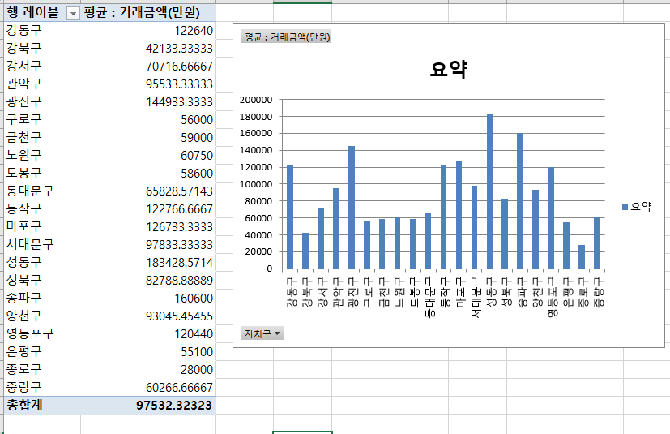
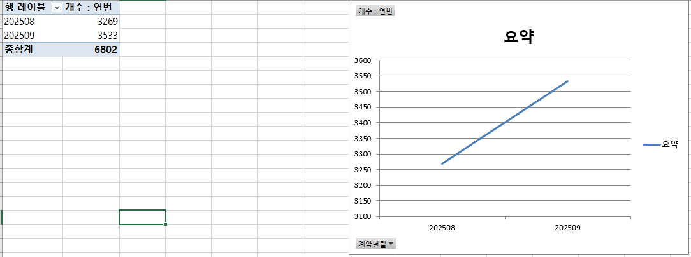

# 서울의 아파트 매매 실거래가 데이터 분석/시각화

## 사용하신 지침들

+ 어떤 엑셀 파일이 열려있어?
    - ✦ 현재 '수정된아파트실거래가_서울시.xlsx' 파일이 열려있습니다.

+ 현재 열려진 엑셀 시트 데이터를 기반으로 데이터 분석해서, 시각화해보자. 단계적으로 확인받으며 진행하자. 단, 오류 상황은 묻지 말고, 네가 알아서 사용법을 알아내서 처리해.

```
✦ 데이터 확인 감사합니다. '아파트 실거래가' 데이터로 보이며, '자치구', '거래금액(만원)', '건축년도' 등의
  유용한 정보가 포함되어 있네요.

  데이터를 분석하여 의미 있는 시각화를 진행하겠습니다.

  첫 번째 분석 제안:

  '자치구'별 평균 '거래금액(만원)'을 비교하는 막대 차트를 생성하여, 어느 지역의 아파트 가격이 평균적으로
  높은지 한눈에 파악해보고자 합니다.


  이 분석을 진행할까요? (Y/N)
```

+ 진행해.

```
 ✦ 피벗 테이블 필드 설정이 완료되었습니다. '자치구'별 평균 '거래금액(만원)'이 계산되었습니다.

  이제 이 피벗 테이블 데이터를 기반으로 '자치구별 평균 거래금액'을 보여주는 세로 막대형 차트를 생성하겠습니다.


  3단계: 피벗 차트 생성
```

+ 월별 거래량을 볼 수 있는 시각화는 뭐야?
```
✦ 월별 거래량을 시각화하는 가장 좋은 방법은 선 차트(Line Chart)입니다. 시간의 흐름에 따른 변화 추이를 명확하게
   보여줄 수 있습니다.


  이를 위해 '계약년월'을 기준으로 거래 건수를 집계하는 피벗 테이블을 만들고, 이 피벗 테이블을 바탕으로 선
  차트를 생성할 수 있습니다.


  이 시각화를 진행할까요? (Y/N)
  ```


## 데이터 인사이트

```
✦ 가격 수준 비교: 어느 구의 아파트 평균 가격이 가장 높고 낮은지 한눈에 파악할 수 있습니다.
✦ 월별 거래량 선 차트가 생성되었다면, 전체적인 거래량의 증가 또는 감소 추세를 한눈에 확인할 수 있습니다.
```


## 생성된 엑셀 시각화 (차트)





## md파일 시각화

+ 메뉴 > 보기 > 명령 팔레트 > makedown open preview