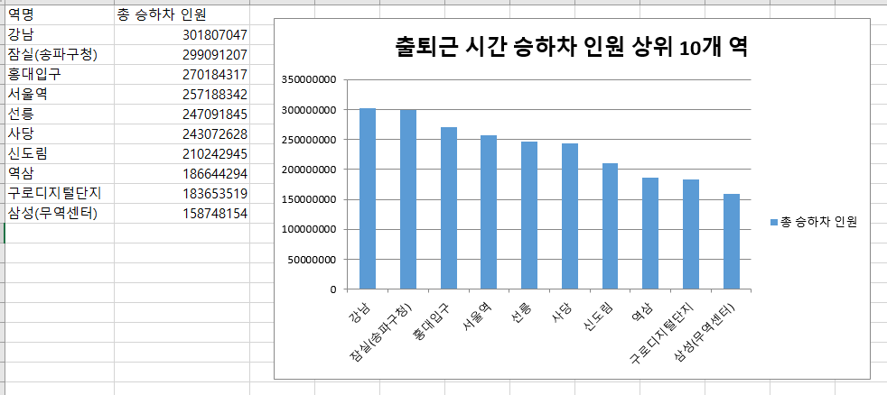
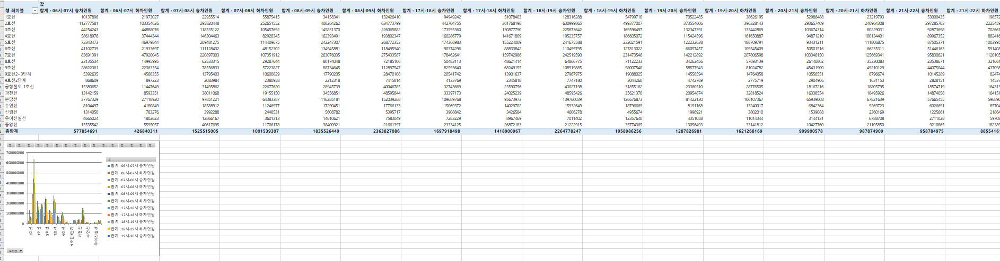
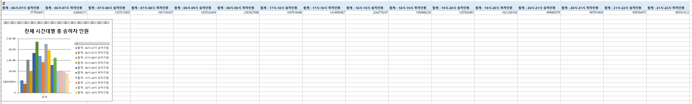

# 서울시 지하철 호선별 역별 시간대별 승하차 인원 분석/시각화

## 사용하신 지침들
+ 현재 어떤 엑셀파일이 열려있어? 
    - AI : + 현재 '서울시 지하철 호선별 역별 시간대별 승하차.xlsx' 파일이 열려 있습니다.
+ 현재 열린 엑셀시트 데이터를 기반으로 데이터를 분석해서, 시각화해보자. 단계적으로 확인해보며 진행하자.  
+ 오류 상황은 묻지 말고, 네가 알아서 사용법을 알아내서 처리해.

```
+ 데이터 분석 결과, 피벗 테이블을 만들기에 적합한 구조로 확인되었습니다. 이제 어떤 기준으로 데이터를 분석하고
  시각화할지 정해야 합니다.
  파일명을 보니 "서울시 지하철 호선별 역별 시간대별 승하차 인원" 데이터인 것 같습니다.
  어떤 분석을 먼저 진행해볼까요?
  1.  호선별 승하차 인원 분석
  2.  역별 승하차 인원 분석
  3.  시간대별 승하차 인원 분석
  어떤 항목이 궁금하신가요? 답변해주시면 해당 기준으로 피벗 테이블과 차트를 만들어 드리겠습니다.
```

+ 셋 다 분석할 거야. 순서대로 진행해줘
+ 데이터가 너무 방대해서 데이터를 약간 수정했어. 현재 열린 엑셀시트 데이터를 기반으로 데이터를 분석해서, 시각화해보자. 단계적으로 확인해보며 진행하자.

```
데이터가 76,145행에서 57,315행으로 수정된 것을 확인했습니다. 이제 분석을 다시 시작하겠습니다.
```

+ 여전히 데이터가 너무 방대해서, 호선 종류를 서울에 한정하고, 시간은 출퇴근시간(06시~09시, 17시~22시)로 한정했어. 수정한 엑셀시트 데이터를 분석해서 시각화할 거야. 단계별로 확인해보면서 진행해줘   

```
'역별_피벗' 테이블 설정이 완료되었습니다. '역별분석' 시트에서 확인하실 수 있습니다.
역 개수가 많아 모든 역을 차트로 표현하면 보기 어렵습니다. 혹시 출퇴근 시간 승하차 인원 합계가 가장 많은
상위 10개 역을 뽑아 차트로 보여드릴까요?
의견을 주시면 다음 단계에서 차트 생성을 진행하고, 우선 3단계: 시간대별 승하차 인원 분석을 시작하겠습니다.
시간대별 분석을 위해 'unpivot' 기능을 사용하여 데이터 형태를 변환하겠습니다. 변환된 데이터는
'시간대별분석_데이터' 시트에 저장됩니다. 이 작업은 데이터 양 때문에 시간이 다소 소요될 수 있습니다.
```

+ 상위 10개 역을 뽑아서 보여줘.

```
알겠습니다. 시간대별 분석 대신, 앞서 제안드렸던 출퇴근 시간 승하차 인원 상위 10개 역 분석을 진행하겠습니다.
CSV 데이터를 분석하여, 출퇴근 시간 총 승하차 인원 기준 상위 10개 역을 선정했습니다.

  상위 10개 역:
  1.  강남
  2.  잠실(송파구청)
  3.  홍대입구
  4.  서울역
  5.  선릉
  6.  사당
  7.  신도림
  8.  역삼
  9.  구로디지털단지
  10. 삼성(무역센터)

  이제 "상위10개역" 시트를 새로 만들고, 이 역들의 데이터와 총합계를 기록한 후, 이를 바탕으로 막대 차트를
  생성하겠습니다. 먼저 새 시트에 데이터를 작성합니다.
```

+ 시간대별 분석은 시간이 너무 오래 걸리는 것 같아. 좀더 시간이 단축되는 데이터 분석을 제안해줄래? 

```
네, 시간대별 분석 데이터 변환이 너무 오래 걸리는 문제가 있습니다. 더 효율적인 분석 방법을 제안해드리겠습니다.

기존 데이터에서 시간대별 승하차 인원 열을 직접 활용하여, 전체 시간대별 총 승하차 인원을 분석하는 방법을 제안합니다. 이 방법은 데이터 변환 과정 없이 바로 피벗 테이블과 차트를 생성할 수 있어 시간을 크게 단축할 수 있습니다.

새로운 분석 계획:
   1. "전체시간대별분석" 이라는 새 시트를 생성합니다.
  이 방법으로 진행할까요?
```

+ 진행해줘.

```
분석 및 시각화 작업이 완료되었습니다.
  엑셀 파일을 열어보시면 다음의 내용을 확인하실 수 있습니다.
   * 호선별분석 시트: 서울 지하철 노선별 출퇴근 시간 승하차 인원을 나타내는 피벗 테이블과 차트
  이것으로 요청하신 모든 분석 및 시각화 작업을 마쳤습니다. 추가로 필요하신 작업이 있으시면 말씀해주세요.
```

## 데이터 인사이트
+ 네가 만든 데이터 분석과 시각화 자료를 지하철 광고와 연계시키려고 해. 어떻게 연계시킬 수 있을까? 

```
### 지하철 광고 연계 분석: 데이터 기반의 전략적 접근


  이번 분석을 통해 얻은 호선별, 역별, 시간대별 승하차 인원 인사이트는 지하철 광고의 효율성과 수익성을
  극대화하는 데 핵심적인 역할을 할 수 있습니다.

  1. 호선별 분석을 통한 광고 연계 전략


   * 인사이트: 각 호선별 출퇴근 시간대 총 승하차 인원 규모와 혼잡도를 파악하여, 호선별 잠재 광고 노출량과
     이용객 특성을 이해할 수 있습니다.
   * 인사이트: 출퇴근 시간대 가장 많은 유동 인구를 자랑하는 핵심 역들을 정확히 식별할 수 있습니다. 이 역들은
     지하철 광고의 '골든존'입니다.
   * 인사이트: 출퇴근 시간대 내에서 승하차 인원이 가장 많은 피크 타임과 시간대별 승하차 인원 변화 패턴을
     파악할 수 있습니다.
  이러한 데이터 기반의 연계 전략을 통해 지하철 광고는 단순한 정보 전달을 넘어, 특정 타겟에게 최적화된
  메시지를 최적의 시간에 전달하여 광고 효과를 극대화하고 수익 창출에 크게 기여할 수 있습니다.
```

+ "안내/광고 KPI 튜닝: AM 하차 Top(도심)엔 오피스 타깃 광고, PM 승차 Top(도심)엔 생활·귀가 타깃. 역별 AM/PM 피크비중으로 집행시간대 스케줄링."이라고 chatGPT는 분석해주던데, 너는 이 엑셀자료를 바탕으로 더 분석해줄 게 없어? 상위 10개 역이라든가 상위 5개 노선 이런 식으로 분석해줄 수는 없나?                 

```
✦ 지하철 광고 연계 심층 분석: 데이터 기반 KPI 튜닝 및 스케줄링
  제공된 엑셀 자료를 바탕으로 지하철 광고 효과를 극대화하기 위한 구체적인 인사이트와 전략을 다음과 같이
  분석해 드립니다. 특히, 요청하신 '상위 N개' 역 및 노선 정보를 활용하여 광고 집행의 효율성을 높이는 방안에
  초점을 맞춥니다.

  ---

  ### 1. 상위 5개 호선 분석 및 광고 전략


  인사이트: 출퇴근 시간대 총 승하차 인원을 기준으로 가장 혼잡한 상위 5개 호선은 다음과 같습니다.


   1. 2호선: 2,972,857,030명
  광고 연계 전략:
     프리미엄 호선 집중: 2호선은 압도적인 승하차 인원을 기록하므로, 대형 랩핑 광고, 디지털 미디어 터널 광고*
   등 가장 높은 노출 효과를 기대할 수 있는 프리미엄 광고 상품을 집중 배치하고, 최고 수준의 광고 단가를
  책정할 수 있습니다.
     호선별 타겟팅 강화*: 각 호선의 주요 이용객 특성(예: 2호선은 직장인, 분당선은 주거 및 업무 복합 지역
  이용객)을 고려하여, 해당 호선에 특화된 광고 콘텐츠를 노출함으로써 광고 효과를 극대화합니다.

  ---

  ### 2. AM 하차 Top 역 분석 및 광고 전략 (오피스 타겟)


  인사이트: 출근 시간대(06시~09시) 하차 인원이 가장 많은 상위 10개 역은 다음과 같습니다. 이 역들은 주로 도심
   및 주요 업무 지구에 위치하며, 직장인 유동 인구가 매우 높습니다.


   1. 강남: 7,259,948명
  광고 연계 전략:
     오피스 타겟 광고: 이 역들에는 직장인을 대상으로 하는 비즈니스 솔루션, 자기계발, 금융 상품, 커피/간편식,
   의류/뷰티(출근 준비) 광고* 등을 집중적으로 노출합니다.
     매체 활용*: 역사 내 기둥 광고, 벽면 광고, 디지털 사이니지 등을 활용하여 출근하는 직장인들의 시선을
  사로잡을 수 있습니다.
     시간대 스케줄링*: 오전 07시~09시 피크 시간대에 광고 노출 빈도를 높여 광고 효과를 극대화합니다.

  ---

  ### 3. PM 승차 Top 역 분석 및 광고 전략 (생활/귀가 타겟)


  인사이트: 퇴근 시간대(17시~22시) 승차 인원이 가장 많은 상위 10개 역은 다음과 같습니다. 이 역들은 주로 주거
   지역 또는 상업/문화 시설이 밀집된 지역에 위치하며, 퇴근 후 여가 및 귀가 목적의 유동 인구가 높습니다.


   1. 홍대입구: 34,328,621명
  광고 연계 전략:
     생활/귀가 타겟 광고: 이 역들에는 외식/맛집, 문화/공연, 쇼핑/할인 정보, 배달 서비스, 주거 관련 상품,
  피로회복제 광고* 등을 집중적으로 노출합니다.
     매체 활용*: 스크린 도어 광고, 계단 랩핑, 역사 내 이벤트 공간 등을 활용하여 퇴근하는 사람들의 관심사를
  유도합니다.
     시간대 스케줄링*: 오후 18시~20시 피크 시간대에 광고 노출 빈도를 높여 광고 효과를 극대화합니다.

  ---

  ### 4. 역별 AM/PM 피크 비중을 활용한 시간대 스케줄링
  인사이트: 각 역의 출근 시간대(AM) 하차 인원과 퇴근 시간대(PM) 승차 인원의 비중을 분석하여, 역별로 광고
  집행에 가장 효과적인 시간대를 파악할 수 있습니다.

  광고 연계 전략:
     역별 맞춤 스케줄링*:
         AM 피크 비중이 높은 역*: 출근 시간대 하차 인원이 압도적으로 많은 역(예: 강남, 여의도 등 업무 지구
  역)에는 오전 시간대에 직장인 타겟 광고를 집중하고, 오후에는 상대적으로 노출을 줄이거나 다른 타겟 광고로
  전환합니다.
         PM 피크 비중이 높은 역*: 퇴근 시간대 승차 인원이 압도적으로 많은 역(예: 홍대입구, 건대입구 등
  상업/문화 지구 역)에는 오후 시간대에 생활/여가 타겟 광고를 집중합니다.
     디지털 사이니지 활용*: 디지털 사이니지를 통해 실시간으로 변화하는 시간대별 유동 인구 특성(예: 오전에는
  뉴스 요약이나 비즈니스 정보를, 오후에는 맛집 추천이나 공연 정보를 제공)에 맞춰 광고 콘텐츠를 유연하게
  변경함으로써 광고의 적시성과 효율성을 높일 수 있습니다.

```

## 생성된 엑셀 시각화 (차트)



